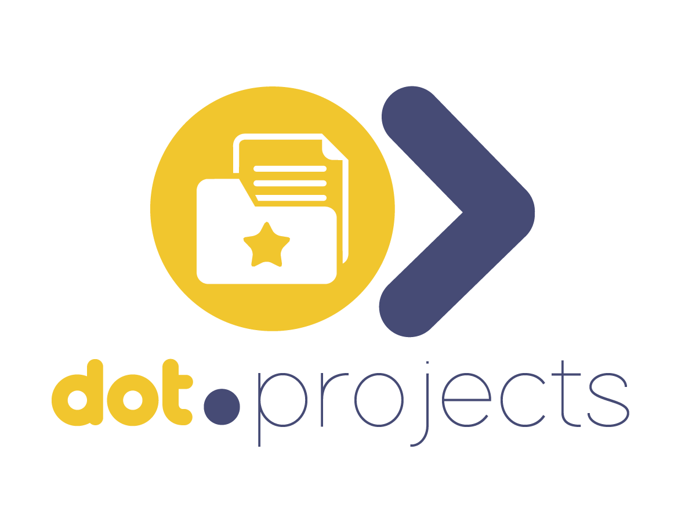

<div align="center">



<h1>Dot.Projects</h1>

<p>AI-powered project management — plan, track, and deliver projects with intelligent milestone generation and a drag-and-drop kanban board.</p>

[](https://php.net)
[](https://laravel.com)
[](https://livewire.laravel.com)
[](https://postgresql.org)
[](tests/)
[](LICENSE)

</div>

---

## Overview

Dot.Projects is the project management platform in the Dot ecosystem. Describe a project and let the AI planner generate a full milestone and task breakdown in seconds, then manage delivery on a 5-column kanban board with HTML5 drag-and-drop.

---

## Features

- **AI Project Planner** — describe a project, Claude generates milestones and tasks with estimates
- **5-column Kanban** — Backlog → To Do → In Progress → Review → Done with drag-and-drop
- **Milestones** — group tasks into delivery milestones with due dates and progress tracking
- **Team collaboration** — assign tasks to team members, add comments, track activity
- **Completion percentage** — auto-calculated from task status across the project
- **AI plan logs** — every AI-generated plan stored for audit and replay
- **Ecosystem SSO** — authenticate from InfoDot with a single click

---

## Domain Model

```
Project → Milestones → ProjectTasks (status: backlog/todo/in_progress/review/done)
       → ProjectComments
       → AiPlanLogs
Team   → Projects
```

---

## Tech Stack

| Layer | Technology |
|---|---|
| Framework | Laravel 12 + PHP 8.4 |
| Frontend | Livewire 3 + Alpine.js + Tailwind CSS |
| Auth | Jetstream 5 + Sanctum (ecosystem SSO) |
| Database | PostgreSQL 16 (shared infodot instance) |
| AI | Anthropic Claude API (mock fallback when key absent) |
| WebSockets | Laravel Reverb |

---

## Quick Start

```bash
git clone https://github.com/sakhileb/Dot.Projects.git && cd Dot.Projects
composer install && npm install
cp .env.example .env && php artisan key:generate
php artisan migrate && npm run dev & php artisan serve
```

```bash
bash bin/test.sh   # 37 passing, 0 failed, 7 skipped
```

---

## Part of the Dot Ecosystem

Dot.Projects connects to [InfoDot](https://github.com/sakhileb/InfoDot) — the central hub. Log in to InfoDot once and navigate here without re-authenticating via `/auth/ecosystem`.

---

MIT — © SK Digital / BluPin Incorporated
