<div align="center">



<br /><br />

**Share ideas, build communities, and stay connected across the Dot ecosystem.**

<br />

   

<br /><br />

**Part of the [InfoDot Ecosystem](https://github.com/sakhileb/InfoDot)** &nbsp;·&nbsp; `pulse.infodot.app`

</div>

---

## What is Dot.Pulse?

Dot.Pulse is the social and community platform in the InfoDot ecosystem. Users post updates, join topic communities, react to content, and follow peers — creating a real-time social graph that keeps the ecosystem community informed and engaged.

## Core Features

- Post feed — rich-text posts with images and link previews
- Communities — topic-based groups with moderation
- Reactions and threaded comments on every post
- Follow graph — follow users and communities
- Real-time feed updates via Laravel Reverb
- Trending topics and discovery feed
- Points and reputation system per community
- Ecosystem SSO from InfoDot hub

## Domain Models

- **Post** — community post with content and media
- **Community** — topic group with membership
- **CommunityMember** — role-based membership record
- **PostReaction** — polymorphic emoji reaction

## Tech Stack

| Layer | Technology |
|---|---|
| Framework | Laravel 12 |
| Language | PHP 8.4 |
| Frontend | Livewire 3 · Alpine.js 3 · Tailwind CSS |
| Database | PostgreSQL 16 (shared across ecosystem) |
| Realtime | Laravel Reverb |
| Auth | Laravel Sanctum (InfoDot SSO) |
| AI | Anthropic Claude (`claude-sonnet-4-6`) |
| Storage | AWS S3 / Local (Flysystem) |
| Search | Laravel Scout · Meilisearch |
| Queue | Redis · Laravel Horizon |

## Quick Start

```bash
git clone https://github.com/sakhileb/Dot.Pulse.git
cd Dot.Pulse
cp .env.example .env
composer install
npm install && npm run build
php artisan key:generate
php artisan migrate
php artisan serve
```

> **Ecosystem SSO:** Set `DB_*` env vars to the shared InfoDot PostgreSQL instance and `APP_URL=https://pulse.infodot.app`. Users authenticated through InfoDot gain access automatically via Sanctum handoff tokens.

## Ecosystem

**Dot.Pulse** is one of **21 platforms** in the InfoDot ecosystem, connected via shared PostgreSQL and Sanctum SSO. Visit [InfoDot](https://github.com/sakhileb/InfoDot) to explore the full platform map.

## License

MIT © [SK Digital / BluPin Incorporated](https://github.com/sakhileb)
