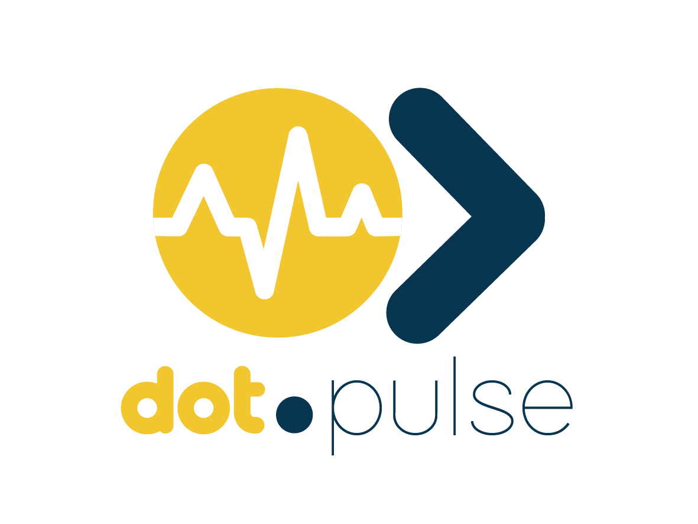

<div align="center">



<br /><br />

**The AI-powered community intelligence platform for the Dot ecosystem.**

<br />


<br />

**Part of the [Dot Ecosystem](https://github.com/sakhileb) · `pulse.infodot.app`**

</div>

---

## What is Dot.Pulse?

Dot.Pulse is the **community intelligence layer** of the Dot ecosystem — an AI-powered platform where every conversation becomes searchable knowledge.

Think **LinkedIn** profiles + **Reddit** communities + **Product Hunt** marketplace + **Stack Overflow** reputation, all inside one platform deeply integrated with Dot.Agents, Dot.Admin, and the rest of the ecosystem.

> *Every company should know the pulse of its users.*

---

## Core Features

### Communities
- Industry-specific communities (Fleet, Mining, Agriculture, AI, etc.)
- Public, private, and enterprise-scoped visibility
- Member roles: member, moderator, admin
- Community rules, banning, and pinned posts

### Feed & Posts
- 17 post types: Discussion, Question, Idea, Bug Report, Release, Success Story, Showcase, Tutorial, Agent, Integration, Event, Article, Poll, Video, Job, Marketplace, Announcement
- AI-ranked smart feed ordered by relevance score, not just chronology
- Threaded comments with nested replies
- Poll creation with live vote results
- File attachments (images, PDFs, video)
- Hashtag system with trending topics

### AI Moderation Pipeline
Every post runs through Claude AI before publishing:
- Spam score, safety score, sentiment analysis
- Automatic approval or flagging
- AI-generated summary, tags, topics, keywords
- Duplicate detection and business relevance scoring
- Manual override via moderation queue

### AI Knowledge Graph
Solved discussions are automatically extracted into a structured knowledge graph:
- Problem → Solution relationships
- Expert → Topic expertise edges
- Product nodes linked to features and use cases

### Marketplace
- Publish and install: AI Agents, Templates, Dashboards, Prompt Libraries, Automations, Integrations, Extensions, Workflows
- One-click install with install count tracking

### Events
- Host: Webinars, AMAs, Product Launches, Demos, Training, Town Halls, Meetups
- RSVP (Going / Maybe / Not Going)
- Community-scoped or platform-wide events

### Reputation & Badges
- Community points for posts (5pts), comments (2pts), accepted solutions (10pts)
- Badges: First Post, Problem Solver, AI Builder, Mentor, Verified Expert, 7-Day Streak
- Per-user leaderboard with solutions accepted count

### Messaging
- Direct conversations between users
- Real-time via Laravel Reverb (WebSockets)
- Participant guard — only conversation members can send

### Notifications
- Database notifications for: comments, reactions, follows, solution accepted, @mentions
- Live unread badge in topbar (30s polling)
- Mark all read action

### Reports & Moderation
- User reporting with reason and details
- Moderation queue with approve / reject actions
- AI decision logging and audit trail

### Search
- Full-text search across posts, communities, and users
- Filterable by post type, community, industry

---

## Tech Stack

| Layer | Technology |
|---|---|
| Framework | Laravel 13 (PHP 8.3) |
| Frontend | Livewire 3 · Alpine.js 3 · Tailwind CSS |
| Build | Vite 8 |
| Database | PostgreSQL (SQLite for local dev) |
| Queue | Database queue (upgrade to Redis for production) |
| Real-time | Laravel Reverb (WebSockets) + Laravel Echo |
| Storage | S3 / local public disk |
| AI | Anthropic Claude (via HTTP) · OpenAI-compatible |
| Auth | Laravel Jetstream (teams) + Fortify + Sanctum |
| Architecture | Actions · Jobs · Events · Listeners · Notifications · Policies · DTOs |

---

## Architecture

```
app/
├── Actions/Pulse/       # Single-responsibility action classes
│   ├── AddComment.php          (points, notifications, @mentions)
│   ├── CreateCommunity.php     (slug generation, auto-join creator)
│   ├── CreateEvent.php
│   ├── FollowUser.php          (toggle, notification)
│   ├── MarkSolution.php        (points, badge check, notification)
│   ├── PublishMarketplaceItem.php
│   ├── ReportContent.php       (rate-limited, idempotent)
│   ├── SendMessage.php         (participant guard, broadcast)
│   ├── SubmitReview.php
│   ├── UploadMedia.php         (S3 or local)
│   └── VotePoll.php
│
├── Events/              # Broadcast events (Reverb)
│   ├── CommentPosted.php       → post.{id} channel
│   ├── MessageSent.php         → conversation.{id} private channel
│   └── PostPublished.php       → feed + community.{id} channels
│
├── Jobs/
│   └── EnrichPost.php          # Async AI moderation (3 retries, backoff)
│
├── Livewire/Pulse/      # 16 Livewire components
│   ├── CommunityDetail.php     (tabs: posts / members / rules)
│   ├── CommunityList.php
│   ├── CreateCommunity.php
│   ├── CreateEventForm.php
│   ├── CreateMarketplaceItem.php
│   ├── CreatePost.php          (file upload, rate limited)
│   ├── EditPulseProfile.php    (avatar/cover upload)
│   ├── EventsList.php          (RSVP)
│   ├── GlobalSearch.php        (posts / communities / people)
│   ├── HomeFeed.php            (paginated, real-time)
│   ├── MarketplaceBrowser.php  (1-click install)
│   ├── Messaging.php           (real-time, private channels)
│   ├── ModerationQueue.php     (approve/reject)
│   ├── NotificationBell.php    (live badge, dropdown)
│   ├── PostDetail.php          (polls, reactions, report, echo)
│   ├── TrendingTopics.php      (5-min cache)
│   └── UserPublicProfile.php   (follow, message, badges)
│
├── Notifications/       # Database + queue notifications
│   ├── MentionNotification.php
│   ├── NewCommentOnPost.php
│   ├── NewFollower.php
│   ├── PostReacted.php
│   └── SolutionAccepted.php
│
├── Policies/            # Authorization
│   ├── CommentPolicy.php
│   ├── CommunityPolicy.php
│   └── PostPolicy.php
│
└── Services/
    ├── AiModerationService.php   # Claude integration + mock fallback
    ├── BadgeAwarder.php          # Badge eligibility checks
    └── KnowledgeGraphService.php # Extract nodes/edges from enrichment
```

---

## REST API v1

All endpoints require `Authorization: Bearer {token}` (Sanctum).

```
GET    /api/v1/feed
GET    /api/v1/posts/{id}
POST   /api/v1/posts
DELETE /api/v1/posts/{id}
POST   /api/v1/posts/{id}/react
POST   /api/v1/posts/{id}/report

GET    /api/v1/posts/{id}/comments
POST   /api/v1/posts/{id}/comments
DELETE /api/v1/comments/{id}

GET    /api/v1/communities
POST   /api/v1/communities
GET    /api/v1/communities/{slug}
POST   /api/v1/communities/{slug}/join
DELETE /api/v1/communities/{slug}/leave

POST   /api/v1/users/{id}/follow

GET    /api/v1/notifications
POST   /api/v1/notifications/mark-read
POST   /api/v1/notifications/{id}/read
GET    /api/v1/notifications/unread-count

GET    /api/v1/search?q=
```

---

## Database Schema

41 tables. Key domains:

| Domain | Tables |
|---|---|
| Identity | users, pulse_profiles, pulse_followers, pulse_user_badges, pulse_badges |
| Content | pulse_posts, pulse_post_enrichments, pulse_comments, pulse_reactions, pulse_hashtags, pulse_media |
| Communities | communities, community_memberships, community_rules |
| Polls | pulse_polls, pulse_poll_votes |
| Events | pulse_events, pulse_event_rsvps |
| Marketplace | pulse_marketplace_items, pulse_marketplace_installs |
| Reviews | pulse_reviews |
| Messaging | pulse_conversations, pulse_conversation_user, pulse_messages |
| Moderation | pulse_reports, pulse_moderation_logs |
| Knowledge | pulse_knowledge_nodes, pulse_knowledge_edges |
| Teams | teams, team_user, team_invitations |

---

## Local Development

```bash
# 1. Clone and install dependencies
git clone https://github.com/sakhileb/Dot.Pulse.git
cd Dot.Pulse
composer install
npm install

# 2. Environment
cp .env.example .env
php artisan key:generate

# DB defaults to SQLite for local dev — no Postgres needed
# To use Postgres: update DB_* vars in .env

# 3. Migrate + seed (creates 16 users, 8 communities, 60 posts, 120+ comments)
php artisan migrate
php artisan db:seed

# 4. Build assets
npm run build
# or for hot reload:
npm run dev

# 5. Start the server
php artisan serve

# Admin login:  admin@pulse.test / password
# Test login:   test@example.com / password
```

### Optional services

```bash
# Run the queue worker (for async AI moderation, notifications)
php artisan queue:work

# Start Reverb WebSocket server (for real-time feed, messaging)
php artisan reverb:start

# Recalculate trending hashtags manually
php artisan pulse:trending

# Run badge checks for all users
php artisan pulse:badges
```

---

## Testing

```bash
# Run all tests (54 tests, 98 assertions)
./vendor/bin/phpunit

# Run only Pulse-specific tests
./vendor/bin/phpunit tests/Feature/Pulse/

# Test coverage categories
# PostTest         — CRUD, reactions, reports, rate limiting, job dispatch
# CommentTest      — threading, points, notifications, @mentions
# CommunityTest    — creation, slug, join/leave, policy enforcement
# FollowTest       — toggle, self-follow guard, notification
# ModerationTest   — role-based access, policy checks
# MessagingTest    — conversation creation, participant guards, real-time
```

---

## Ecosystem SSO

Dot.Pulse supports token-based SSO from the InfoDot hub:

```
GET /auth/ecosystem?token={sanctum_token}
```

The token must have the `ecosystem:read` ability and not be expired. On success the user is logged in and redirected to the dashboard.

---

## Scheduled Tasks

```
php artisan pulse:trending   → hourly   (recalculates hashtag counts + busts cache)
php artisan pulse:badges     → 3:00 AM  (runs badge eligibility for all active users)
queue:work --stop-when-empty → every 5m (processes pending jobs)
```

---

## Contributing

This project follows the Dot ecosystem coding standards:

- **Actions** for all write operations (single-responsibility, testable)
- **Jobs** for all async work (queued, retryable)
- **Events** for side effects that cross module boundaries
- **Policies** for all authorization decisions
- **Notifications** for all user-facing alerts
- Feature tests for every public action and API endpoint

